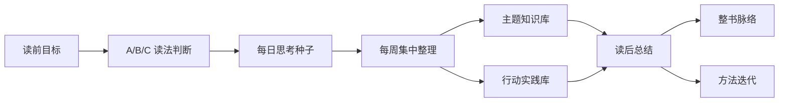

<div align="center">

# cyysf-read

一个以“思考、整理、行动、复盘”为核心的个人阅读知识库。


[知识库入口](00_入口/知识库入口.md) ·
[书籍索引](07_索引/书籍索引.md) ·
[方法系统](07_索引/方法系统索引.md) ·
[行动实践](03_行动实践库/行动实践看板.md)

</div>

---

## 这个仓库是什么

`cyysf-read` 是我的个人阅读记录主库，用来长期保存读书过程中的目标、划线思考、阶段复盘、主题卡片、行动原则和方法迭代。

它的重点不是“我读了多少书”，而是让阅读形成一个闭环：

```text
读前带着问题进入书里，读中留下自己的思考，读后回到现实行动。
```

| 维度 | 说明 |
|---|---|
| 仓库定位 | 个人阅读知识库、Obsidian vault、GitHub 备份主库 |
| 核心目标 | 把阅读转化为理解、判断、表达和行动 |
| 当前方法 | 读前目标、A/B/C 读法判断、每日思考种子、每周集中整理、读后复盘 |
| 智能体协作 | Codex、WorkBuddy 或其他智能体都可以维护，但必须以 GitHub 为唯一事实来源 |
| 执行原则 | 用户先思考，智能体后整理 |

## 核心分工

```text
仓库 = 记录层
skill = 执行层
weread-skills = 可选输入工具
```

| 模块 | 负责什么 |
|---|---|
| 本仓库 | 保存阅读记录、模板、索引、系统档案和 skill 迭代记录 |
| `cyysf-reading-vault` | 协助提问、分析、整理、归档、提交和推送 |
| `weread-skills` | 拉取微信读书划线和笔记，作为可选输入来源 |

## 阅读系统流程



| 阶段 | 要做什么 | 写入位置 |
|---|---|---|
| 读前 | 明确为什么读、想解决什么问题、适合精读还是轻读 | `01_书籍记录/<书名>/01_读前目标与读法判断.md` |
| 每日 | 只保留 1-3 条真正有触动的思考种子 | `01_书籍记录/<书名>/02_每日思考/` |
| 每周 | 集中整理主题、行动和阶段复盘 | `01_书籍记录/<书名>/03_阶段复盘/` |
| 读后 | 回到读前目标，判断这本书真正给了我什么 | `01_书籍记录/<书名>/04_读后总结.md` |
| 精读书 | 快速二刷，梳理全书结构和核心脉络 | `01_书籍记录/<书名>/05_整书脉络.md` |
| 行动 | 追踪读到的原则是否真的进入现实 | `03_行动实践库/` |

## 仓库结构

```text
cyysf-read/
├─ 00_入口/             日常入口、工作台、项目状态
├─ 01_书籍记录/         每本书的完整记录
├─ 02_主题知识库/       跨书主题卡片
├─ 03_行动实践库/       行动原则与实践看板
├─ 04_原始输入/         微信读书、临时摘录等输入材料
├─ 05_Obsidian视图/     Bases 和 Canvas
├─ 06_模板/             记录模板
├─ 07_索引/             书籍、主题、行动、方法索引
├─ 08_系统档案/         方法迭代、同步规则、协作记录、skill 迭代
├─ 99_归档/             历史或暂停内容
└─ vault.config.yaml    仓库与 skill 的接口约定
```

单本书使用统一结构：

```text
01_书籍记录/<书名>/
├─ 00_书籍总览.md
├─ 01_读前目标与读法判断.md
├─ 02_每日思考/
├─ 03_阶段复盘/
├─ 04_读后总结.md
├─ 05_整书脉络.md
└─ 06_方法实践记录.md
```

## 快速入口

| 类型 | 链接 |
|---|---|
| 首页 | [知识库入口](00_入口/知识库入口.md) |
| 本周工作台 | [本周阅读工作台](00_入口/本周阅读工作台.md) |
| 项目状态 | [项目状态](00_入口/项目状态.md) |
| 书籍 | [书籍索引](07_索引/书籍索引.md) |
| 每日思考 | [每日思考索引](07_索引/每日思考索引.md) |
| 主题 | [主题索引](07_索引/主题索引.md) |
| 行动 | [行动原则索引](07_索引/行动原则索引.md) |
| 方法 | [方法系统索引](07_索引/方法系统索引.md) |

## 当前实践

阅读方法从 5 本书开始测试。第一本样本书是：

| 书籍 | 状态 | 入口 |
|---|---|---|
| 《道商范蠡》 | 已读完，已进入读后总结与方法复盘 | [书籍总览](01_书籍记录/道商范蠡/00_书籍总览.md) |

当前重点不是继续堆积划线，而是观察这些阅读原则有没有进入现实行动：

- [行动实践看板](03_行动实践库/行动实践看板.md)

## 新环境恢复

换电脑或换平台时，先克隆仓库：

```bash
git clone https://github.com/CodeManYsf/cyysf-read.git
```

然后准备：

| 工具 | 是否必需 | 用途 |
|---|---|---|
| Obsidian | 推荐 | 打开本仓库作为本地知识库 |
| `cyysf-reading-vault` | 必需 | 指引智能体执行阅读系统 |
| `weread-skills` | 可选 | 拉取微信读书划线和笔记 |

## 多智能体协作

所有智能体平台必须把 GitHub 仓库当作唯一事实来源。

开始前读取：

1. [README.md](README.md)
2. [AGENTS.md](AGENTS.md)
3. [vault.config.yaml](vault.config.yaml)
4. [知识库入口](00_入口/知识库入口.md)

标准流程：

```bash
git status
git pull --ff-only
git add .
git commit -m "[平台] 类型：YYYY-MM-DD 主题"
git push
```

协作原则：

| 原则 | 说明 |
|---|---|
| 不拆平台记录 | 阅读内容统一进入阅读系统，不分 Codex 版、WorkBuddy 版 |
| 操作单独留痕 | 平台操作记录写入 `08_系统档案/多智能体协作记录/<平台>/` |
| 不覆盖他人改动 | 遇到冲突、远程落后、无法推送时停止并说明 |
| 用户先思考 | 智能体不能直接替用户总结，必须先保留用户自己的理解 |

## Skill 迭代

`cyysf-reading-vault` 的设计、版本、安装说明和源码快照保存在：

- [skill 迭代档案](08_系统档案/skill迭代/cyysf-reading-vault/cyysf-reading-vault%20迭代说明.md)

当前接口文件：

- [vault.config.yaml](vault.config.yaml)

## 一句话

```text
每日轻量积累，每周集中整理，读后回到目标，最终落到行动。
```
